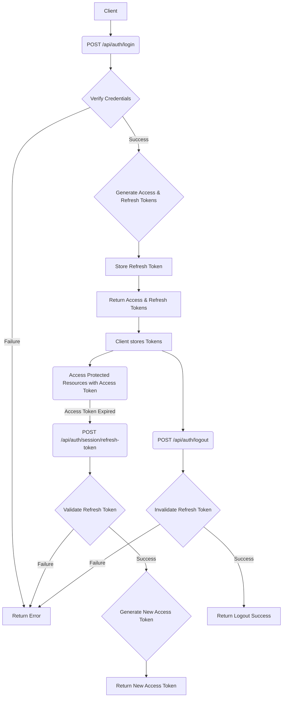

# Authentication API

## Table of Contents
* [Endpoints](#endpoints)
    * [Registration](#registration)
    * [Verification](#verification)
    * [Authentication](#authentication)
    * [Session Management](#session-management)
* [How the API Works and Must Be Used](#how-the-api-works-and-must-be-used)
    * [Authentication Flow](#authentication-flow)
    * [Registration and Verification Flow](#registration-and-verification-flow)
* [Diagram: Authentication Flow](#diagram-authentication-flow)
* [Environment Variables](#environment-variables)

This API provides a robust solution for user authentication, registration, session management, and account verification. It's designed to be secure and flexible, allowing seamless integration into various client applications.

## Endpoints

The API base URL is `http://localhost:3000/api`.

### Registration

#### `POST /api/auth/register`
Registers a new user with a username, email, and password. Upon successful registration, a verification token is generated and returned, which is used to activate the account.

- **Request Body:**
    ```json
    {
      "username": "string",
      "email": "string (email format)",
      "password": "string (min 8 chars, uppercase, lowercase, number, special char)",
      "confirmationPassword": "string (must match password)"
    }
    ```
- **Response (201 Created):**
    ```json
    {
      "message": "User registered successfully. Verify your account with the provided token.",
      "verification_token": "string (UUID)"
    }
    ```
- **Response (400 Bad Request):**
    ```json
    {
      "error": "Missing required fields: { username, email, password, confirmationPassword }"
    }
    ```
    or
    ```json
    {
      "error": "Email must be in a valid format"
    }
    ```
    or
    ```json
    {
      "error": "Password and confirmation password do not match"
    }
    ```
    or
    ```json
    {
      "error": "Password is not safe. It must be at least 8 characters long and contain at least one uppercase letter, one lowercase letter, one number, and one special character."
    }
    ```
- **Response (409 Conflict):**
    ```json
    {
      "error": "Email is already in use"
    }
    ```
- **Response (500 Internal Server Error):**
    ```json
    {
      "error": "Internal server error"
    }
    ```

### Verification

#### `POST /api/auth/verify/refresh-token`
Verifies a user's account using the verification token received after registration.

- **Request Body:**
    ```json
    {
      "token": "string (UUID)"
    }
    ```
- **Response (200 OK):
    ```json
    {
      "message": "Account verified successfully",
      "user": {
        "id": "string",
        "username": "string",
        "email": "string"
      }
    }
    ```
- **Response (400 Bad Request):**
    ```json
    {
      "error": "Invalid or missing token"
    }
    ```
- **Response (404 Not Found):**
    ```json
    {
      "error": "Token not associated with any user"
    }
    ```
- **Response (410 Gone):**
    ```json
    {
      "error": "Verification token has expired"
    }
    ```
- **Response (500 Internal Server Error):**
    ```json
    {
      "error": "Internal server error"
    }
    ```

#### `POST /api/auth/verify/access-token`
Validates an access token to check its authenticity and expiry.

- **Request Body:**
    ```json
    {
      "token": "string (JWT)"
    }
    ```
- **Response (200 OK):**
    ```json
    {
      "message": "Access token is valid",
      "user": {
        "id": "string",
        "username": "string",
        "email": "string"
      }
    }
    ```
- **Response (401 Unauthorized):**
    ```json
    {
      "error": "Access token has expired"
    }
    ```
    or
    ```json
    {
      "error": "Invalid access token"
    }
    ```
- **Response (500 Internal Server Error):**
    ```json
    {
      "error": "Internal server error"
    }
    ```

### Authentication

#### `POST /api/auth/login`
Authenticates a user with their email and password. Upon successful login, it returns an access token and a refresh token.

- **Request Body:**
    ```json
    {
      "email": "string (email format)",
      "password": "string"
    }
    ```
- **Response (200 OK):**
    ```json
    {
      "message": "Login successful",
      "accessToken": "string (JWT)",
      "refreshToken": "string (JWT)",
      "user": {
        "id": "string",
        "username": "string",
        "email": "string"
      }
    }
    ```
- **Response (400 Bad Request):**
    ```json
    {
      "error": "Email and password are required"
    }
    ```
- **Response (401 Unauthorized):**
    ```json
    {
      "error": "Incorrect email or password"
    }
    ```
- **Response (403 Forbidden):**
    ```json
    {
      "error": "Account has not been verified yet"
    }
    ```
- **Response (500 Internal Server Error):**
    ```json
    {
      "error": "Internal server error"
    }
    ```

#### `POST /api/auth/logout`
Logs out a user by invalidating their refresh token.

- **Request Body:**
    ```json
    {
      "refreshToken": "string (JWT)"
    }
    ```
- **Response (200 OK):**
    ```json
    {
      "message": "Logout successful"
    }
    ```
- **Response (400 Bad Request):**
    ```json
    {
      "error": "Refresh Token required"
    }
    ```
- **Response (404 Not Found):**
    ```json
    {
      "error": "Refresh token not found"
    }
    ```
- **Response (500 Internal Server Error):**
    ```json
    {
      "error": "Internal server error"
    }
    ```

### Session Management

#### `POST /api/auth/session/refresh-token`
Generates a new access token using a valid refresh token.

- **Request Body:**
    ```json
    {
      "refreshToken": "string (JWT)"
    }
    ```
- **Response (200 OK):**
    ```json
    {
      "accessToken": "string (JWT)"
    }
    ```
- **Response (401 Unauthorized):**
    ```json
    {
      "error": "Refresh Token required"
    }
    ```
- **Response (403 Forbidden):**
    ```json
    {
      "error": "Invalid or expired Refresh Token"
    }
    ```
    or
    ```json
    {
      "error": "User not found"
    }
    ```
- **Response (500 Internal Server Error):**
    ```json
    {
      "error": "Internal server error"
    }
    ```

## How the API Works and Must Be Used

### Authentication Flow

The API uses a combination of access tokens and refresh tokens for secure authentication.

1.  **Login**:
    *   The client sends a `POST` request to `/api/auth/login` with the user's email and password.
    *   If credentials are valid, the API returns an `accessToken` and a `refreshToken`.
    *   The `accessToken` is short-lived and used to access protected resources.
    *   The `refreshToken` is long-lived and used to obtain new access tokens without re-authenticating.
    *   The client should store both tokens securely. The `accessToken` is typically stored in memory, and the `refreshToken` can be stored in an HTTP-only cookie or secure local storage.

2.  **Accessing Protected Resources**:
    *   To verify if an `accessToken` is still valid, the client should send a `POST` request to `/api/auth/verify/access-token` with the `accessToken` in the request body.
    *   If the token is valid, the API will respond with a success message. If it's expired or invalid, an appropriate error will be returned.
    *   For protected endpoints, the client must include the `accessToken` in the `Authorization` header as a Bearer token: `Authorization: Bearer <accessToken>`. The server-side middleware will then validate this token.

3.  **Refreshing Access Tokens**:
    *   When an `accessToken` expires (indicated by a 401 Unauthorized response from a protected resource), the client should use the `refreshToken` to obtain a new `accessToken`.
    *   Send a `POST` request to `/api/auth/session/refresh-token` with the `refreshToken` in the request body.
    *   If the `refreshToken` is valid, the API returns a new `accessToken`. The client should then retry the original request with the new `accessToken`.

4.  **Logout**:
    *   To log out, the client sends a `POST` request to `/api/auth/logout` with the `refreshToken` in the request body.
    *   This invalidates the `refreshToken` on the server-side, preventing it from being used to generate new access tokens.
    *   The client should also clear any stored tokens.

### Registration and Verification Flow

1.  **Register**:
    *   The client sends a `POST` request to `/api/auth/register` with the user's details.
    *   The API registers the user and returns a `verification_token`.
    *   In a real-world scenario, this token would be sent to the user's email address.

2.  **Verify Account**:
    *   The user receives the `verification_token` (e.g., via email).
    *   The client sends a `POST` request to `/api/auth/verify/refresh-token` with this `verification_token`.
    *   Upon successful verification, the user's account is activated.

## Diagram: Authentication Flow


## Environment Variables

To run this project, you will need to add the following environment variables to your `.env` file:

```
MONGO_URI=
REFRESH_TOKEN_SECRET=
REFRESH_TOKEN_EXPIRES_IN=7d
ACCESS_TOKEN_SECRET=
ACCESS_TOKEN_EXPIRES_IN=15m
REGISTER_TOKEN_EXPIRATION_MINUTES=30
PORT=5000
NODE_ENV='development'
API_KEY='your_secret_api_key'
MONGO_INITDB_ROOT_USERNAME=
MONGO_INITDB_ROOT_PASSWORD=
MONGO_INITDB_DATABASE=
```